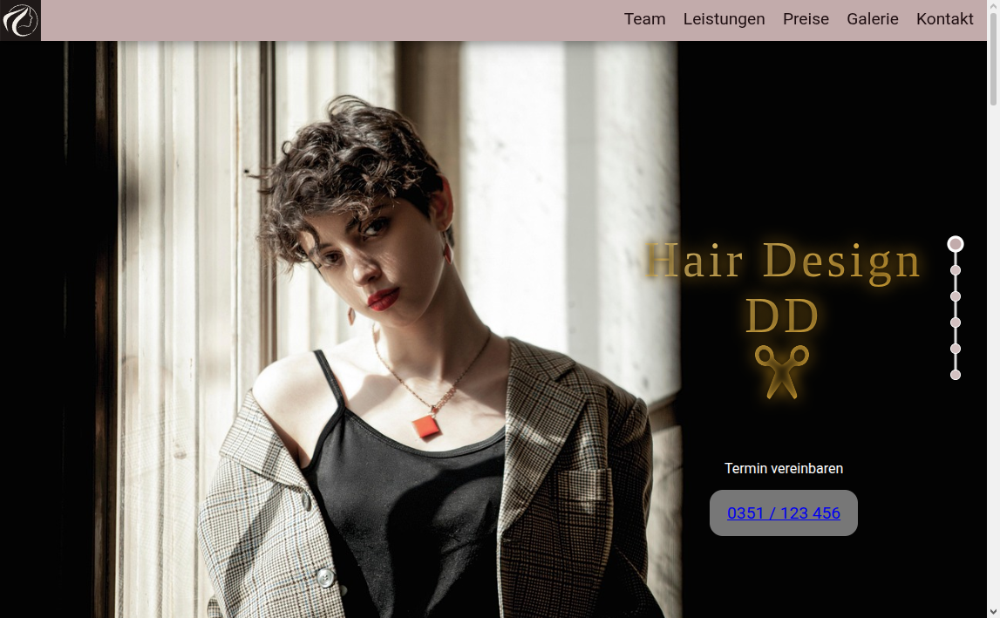
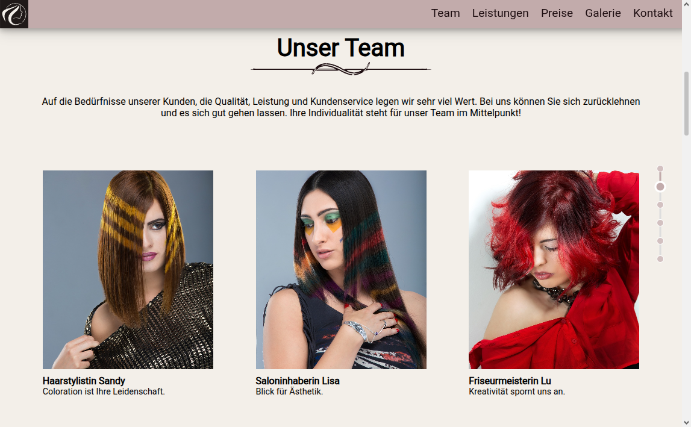
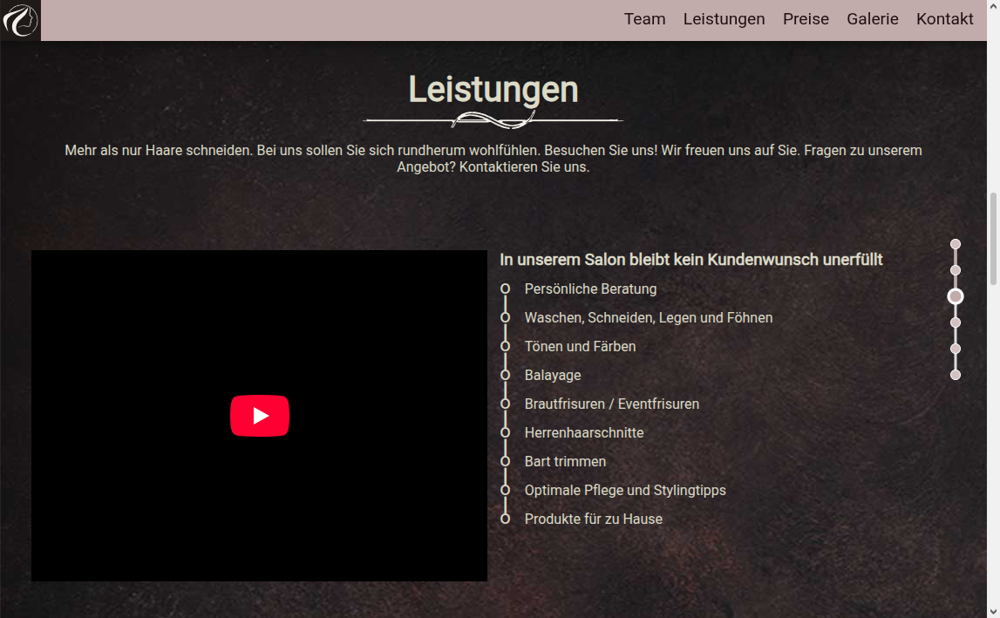
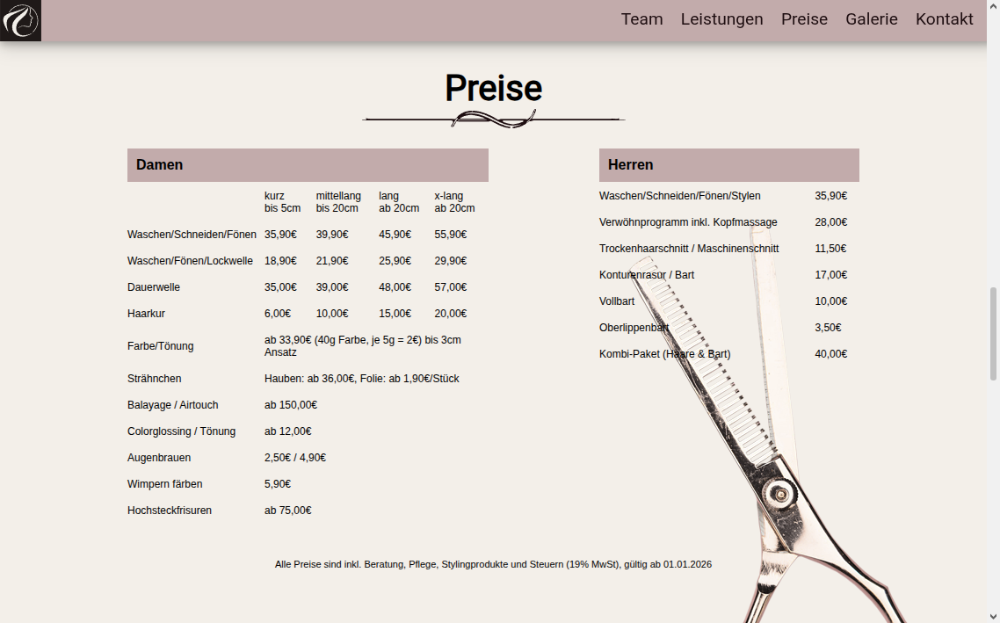
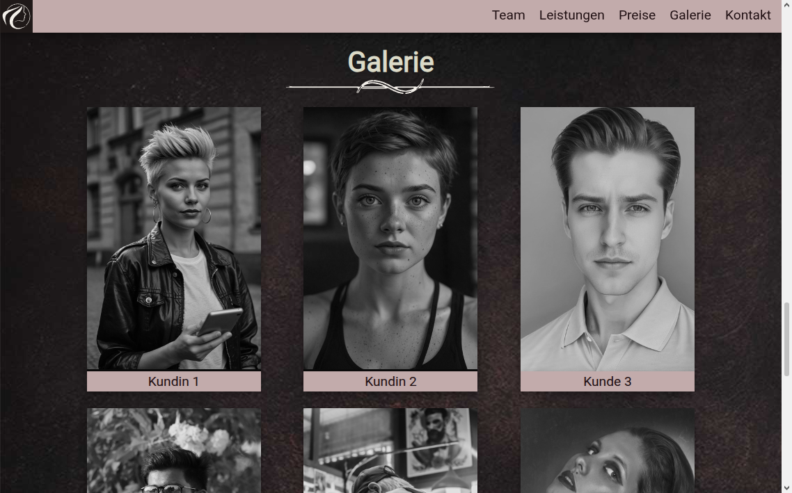
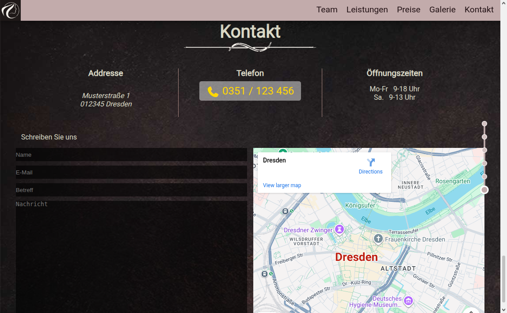

# 💇‍♀️ Hair Design – Onepager Website


> **Moderne Onepager-Webseite für ein Hair Design Studio**
> Ästhetisch. Schnell. Kompakt.

---

## ✨ Projektübersicht

Diese Repository enthält eine **Onepager-Webseite für ein fiktives Hair Design Studio**, entwickelt mit Fokus auf **Design**, **klare Nutzerführung** und **Markenwirkung**.

Die Seite richtet sich an Friseursalons, Hair Stylisten oder Beauty Brands, die online **einen soliden ersten Eindruck** hinterlassen möchten – minimalistisch, elegant und visuell überzeugend.

Alle visuellen Inhalte basieren auf **lizenzfreien Stockfotos von Pixabay**, sorgfältig ausgewählt.

---

## 🎯 Ziel & Wirkung

* Sofortiges Vertrauen durch modernes UI/UX
* Klare Präsentation von Leistungen & Stil
* Hohe Wiedererkennung der Marke
* Optimiert für Kundengewinnung & Terminbuchung

> 💡 *Der Onepager ist bewusst reduziert, um Besucher nicht zu überfordern und gezielt zur Handlung zu führen.*

---

## 🧩 Features

* ✔️ **Mobile-First Ansatz** – konsequent für Smartphones entwickelt und anschließend für größere Screens erweitert
* ✔️ Elegantes, zeitloses Hair-Design-Layout
* ✔️ Onepager-Struktur mit klaren Sektionen
* ✔️ Hochauflösende Stockbilder (Pixabay)
* ✔️ Responsive Design (Desktop, Tablet, Mobile)
* ✔️ Saubere Typografie & starke visuelle Hierarchie

---

## 🛠️ Tech Stack

* **HTML5** – semantisch & sauber
* **CSS3 / ggf. SCSS** – modernes Styling
* **JavaScript (Vanilla)** – leichte Interaktionen

---

## 📸 Bildmaterial & Lizenzen

Alle verwendeten Bilder stammen von **Pixabay** und sind:

* lizenzfrei
* für kommerzielle Nutzung erlaubt
* ohne Attribution nutzbar

Dennoch wurde bei der Auswahl besonders auf:

* Qualität
* Authentizität
  geachtet.

---

## 🚀 Lokale Nutzung

```bash
# Repository klonen
git clone https://github.com/wm87/onepager-hair-design.git

# Projekt öffnen
cd onepager-hair-design

# index.html im Browser öffnen
```

Kein Build-Prozess notwendig – **direkt einsatzbereit**.

---

## 🎨 Designphilosophie

> *Mobile zuerst gedacht – Design ohne Kompromisse.*

Die Webseite wurde nach dem **Mobile-First-Prinzip** konzipiert. Der Fokus liegt zunächst auf kleinen Displays, klaren Hierarchien und schneller Ladezeit. Anschließend wird das Layout gezielt für Tablet- und Desktop-Ansichten erweitert.

Zentrale Designprinzipien:

* Mobile Usability als Ausgangspunkt
* Weißraum statt Überladung
* Bildsprache vor Textwüste
* Klarer Fokus auf den Menschen

---

## 📈 Einsatzmöglichkeiten

* Friseursalons
* Hair Stylisten (Personal Brand)
* Beauty Studios
* Portfolio-Webseite
* Landingpage für Terminbuchung

---

## Sections








---

## 📄 Lizenz

Dieses Projekt ist unter der **MIT License** veröffentlicht.
